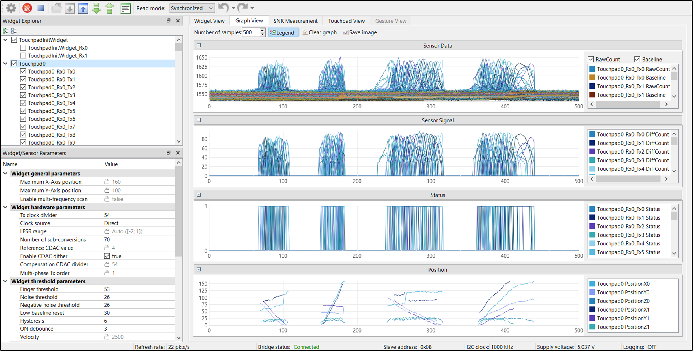
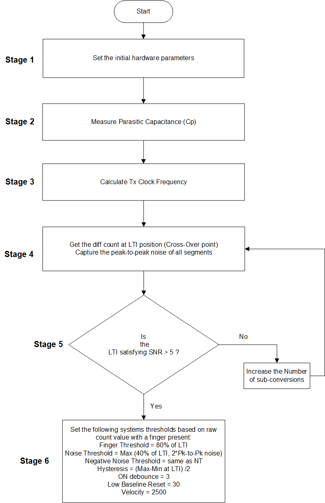
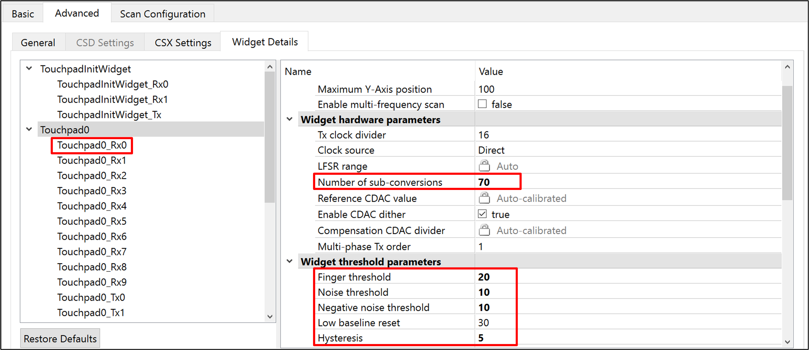
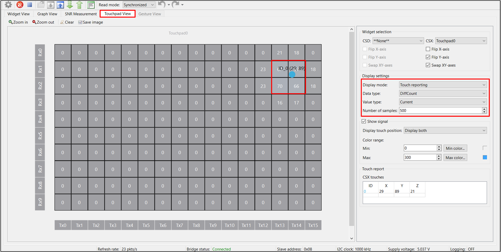

# PSoC 4: MSC multi-touch mutual-capacitance touchpad tuning

**Alpha Release Content** - Support for PSoC 4 family devices on ModusToolbox is currently in alpha stage. Features may change without notice. Contact [Cypress Support](https://www.cypress.com/support) for additional details.

This code example demonstrates how to manually tune a mutual-capacitance-based touchpad widget in PSoC&trade; 4 devices using the multi sense converter (MSC) CSX-RM sensing technique and CapSense&trade; tuner. Here, CSX represents the mutual-capacitance sensing technique and RM represents the ratiometric method.

[Provide feedback on this code example.](https://cypress.co1.qualtrics.com/jfe/form/SV_1NTns53sK2yiljn?Q_EED=eyJVbmlxdWUgRG9jIElkIjoiQ0UyMzIyNzUiLCJTcGVjIE51bWJlciI6IjAwMi0zMjI3NSIsIkRvYyBUaXRsZSI6IlBTb0MgNDogTVNDIG11bHRpLXRvdWNoIG11dHVhbC1jYXBhY2l0YW5jZSB0b3VjaHBhZCB0dW5pbmciLCJyaWQiOiJzYWhnIiwiRG9jIHZlcnNpb24iOiIxLjAuMCIsIkRvYyBMYW5ndWFnZSI6IkVuZ2xpc2giLCJEb2MgRGl2aXNpb24iOiJNQ0QiLCJEb2MgQlUiOiJJQ1ciLCJEb2MgRmFtaWx5IjoiUFNPQyJ9)

## Requirements

- [ModusToolbox&trade; software](https://www.cypress.com/products/modustoolbox-software-environment) v2.2

  **Note:** This code example version requires ModusToolbox software version 2.2 and is not backward compatible with v2.1 or older versions.

- Board support package (BSP) minimum required version: 0.5.0
- Programming language: C
- Associated parts: [PSoC 4100S Max](https://www.cypress.com/documentation/datasheets/psoc-4-psoc-4100s-max-datasheet-programmable-system-chip-psoc)

## Supported toolchains (make variable 'TOOLCHAIN')

- GNU Arm® embedded compiler v9.3.1 (`GCC_ARM`) - Default value of `TOOLCHAIN`
- Arm compiler v6.13 (`ARM`)
- IAR C/C++ compiler v8.42.2 (`IAR`)

## Supported kits (make variable 'TARGET')

- [CY8CKIT-041S-MAX PSoC 4100S Max pioneer kit](https://www.cypress.com/documentation/development-kitsboards/psoc-4100s-max-pioneer-kit-cy8ckit-041s-max) (`CY8CKIT-041S MAX`) - Default target

## Hardware setup

This example uses the board's default configuration. See the [kit user guide](https://www.cypress.com/file/520036/download) to ensure that the board is configured correctly to VDDA at 5 V (J10 should be at position 1 and 2). If you are using the code example at a VDDA voltage other than 5 V, set up the device power voltages correctly to ensure proper operation of the device power domains.  See [Set up the VDDA supply voltage in Device configurator](#set-up-the-vdda-supply-voltage-in-device-configurator) for more details.

## Software setup

This example requires no additional software or tools.

## Using the code example

Create the project and open it using one of the following:

<details><summary><b>In Eclipse IDE for ModusToolbox</b></summary>

1. Click the **New Application** link in the **Quick Panel** (or, use **File** > **New** > **ModusToolbox Application**). This launches the [Project Creator](http://www.cypress.com/ModusToolboxProjectCreator) tool.

2. Pick a kit supported by the code example from the list shown in the **Project Creator - Choose Board Support Package (BSP)** dialog.

   When you select a supported kit, the example is reconfigured automatically to work with the kit. To work with a different supported kit later, use the [Library Manager](https://www.cypress.com/ModusToolboxLibraryManager) to choose the BSP for the supported kit. You can use the Library Manager to select or update the BSP and firmware libraries used in this application. To access the Library Manager, click the link from the **Quick Panel**.

   You can also just start the application creation process again and select a different kit.

   If you want to use the application for a kit not listed here, you may need to update the source files. If the kit does not have the required resources, the application may not work.

3. In the **Project Creator - Select Application** dialog, choose the example by enabling the checkbox.

4. Optionally, change the suggested **New Application Name**.

5. Enter the local path in the **Application(s) Root Path** field to indicate where the application needs to be created.

   Applications that can share libraries can be placed in the same root path.

6. Click **Create** to complete the application creation process.

For more details, see the [Eclipse IDE for ModusToolbox User Guide](https://www.cypress.com/MTBEclipseIDEUserGuide) (locally available at *{ModusToolbox install directory}/ide_{version}/docs/mt_ide_user_guide.pdf*).

</details>

<details><summary><b>In command-line interface (CLI)</b></summary>

ModusToolbox provides the Project Creator as both a GUI tool and a command line tool to easily create one or more ModusToolbox applications. See the "Project Creator Tools" section of the [ModusToolbox User Guide](https://www.cypress.com/ModusToolboxUserGuide) for more details.

Alternatively, you can manually create the application using the following steps:

1. Download and unzip this repository onto your local machine, or clone the repository.

2. Open a CLI terminal and navigate to the application folder.

   On Windows, use the command line "modus-shell" program provided in the ModusToolbox installation instead of a standard Windows command line application. This shell provides access to all ModusToolbox tools. You can access it by typing `modus-shell` in the search box in the Windows menu.

   In Linux and macOS, you can use any terminal application.

   **Note:** The cloned application contains a default BSP file (*TARGET_xxx.mtb*) in the *deps* folder. Use the [Library Manager](https://www.cypress.com/ModusToolboxLibraryManager) (`make modlibs` command) to select and download a different BSP file, if required. If the selected kit does not have the required resources or is not [supported](#supported-kits-make-variable-target), the application may not work.

3. Import the required libraries by executing the `make getlibs` command.

Various CLI tools include a `-h` option that prints help information to the terminal screen about that tool. For more details, see the [ModusToolbox User Guide](https://www.cypress.com/ModusToolboxUserGuide) (locally available at *{ModusToolbox install directory}/docs_{version}/mtb_user_guide.pdf*).

</details>

<details><summary><b>In third-party IDEs</b></summary>

1. Follow the instructions from the **In command-line interface (CLI)** section to create the application, and import the libraries using the `make getlibs` command.

2. Export the application to a supported IDE using the `make <ide>` command.

   For a list of supported IDEs and more details, see the "Exporting to IDEs" section of the [ModusToolbox User Guide](https://www.cypress.com/ModusToolboxUserGuide) (locally available at *{ModusToolbox install directory}/docs_{version}/mtb_user_guide.pdf*.

3. Follow the instructions displayed in the terminal to create or import the application as an IDE project.

</details>

The project already has the necessary settings by default, so you can go to the [Test the basic operation](#test-the-basic-operation) section to verify the operation. If you want to understand the tuning process and follow the stages for this kit or your own board, go to [Tuning procedure](#tuning-procedure) and then test it using the [Test the basic operation](#test-the-basic-operation) section.

## Overview

This document includes:

- A testing section to showcase the performance of a CSX-RM touchpad widget to track two fingers.

- A high-level overview of the CSX-RM touchpad widget tuning flow. 

- A procedure that explains how to use the CapSense Tuner to monitor the CapSense raw data and fine-tune the CSX-RM touchpad for optimum performance in parameters such as response time and linearity.


## Test the basic operation

1. Power the device by plugging a USB 2.0 Type A to Micro-B cable on J8 (USB Micro-B connector).

   **Figure 1. Connecting the CY8CKIT-041S-MAX kit with CapSense expansion board to a PC**

   

2. Program the board using one of the following:

   <details><summary><b>Using Eclipse IDE for ModusToolbox</b></summary>

      1. Select the application project in the Project Explorer.

      2. In the **Quick Panel**, scroll down, and click **\<Application Name> Program (KitProg3_MiniProg4)**.
   </details>

   <details><summary><b>Using CLI</b></summary>

     From the terminal, execute the `make program` command to build and program the application using the default toolchain to the default target. You can specify a target and toolchain manually:
      ```
      make program TARGET=<BSP> TOOLCHAIN=<toolchain>
      ```

      Example:
      ```
      make program TARGET=CY8CPROTO-062-4343W TOOLCHAIN=GCC_ARM
      ```
   </details>

<br>

3. After programming, the application starts automatically.

4. To test the application, slide your finger over the CapSense Touchpad and notice that the user LED turns ON when touched and turns OFF when the finger is lifted.

### Monitor data using the CapSense tuner

1. Open CapSense tuner from the **Tools** section in the IDE Quick Panel.

   You can also run the CapSense tuner application standalone from *{ModusToolbox install directory}/ModusToolbox/tools_{version}/capsense-configurator/capsense-tuner*. In this case, after opening the application, select **File** > **Open** and open the *design.cycapsense* file of the respective application, which is present in the *{Application root directory}/COMPONENT_CUSTOM_DESIGN_MODUS/TARGET_\<BSP-NAME>* folder.

   See the [ModusToolbox User Guide](https://www.cypress.com/ModusToolboxUserGuide) (locally available at *{ModusToolbox install directory}/docs_{version}/mtb_user_guide.pdf*) for options to open the CapSense Tuner Application using the CLI.

2. Ensure that the kit is in CMSIS-DAP bulk mode (KitProg3 status LED is ON and not blinking). See [Firmware-loader](https://github.com/cypresssemiconductorco/Firmware-loader) to learn on how to update the firmware and switch modes in KitProg3.

3. In the tuner application, click on the **Tuner Communication Setup** icon or Select **Tools** > **Tuner Communication Setup**. In the window that appears, select the I2C checkbox under KitProg3 and configure as follows:

   - **I2C address:** 8
   - **Sub-address:** 2 bytes
   - **Speed (kHz):** 1000

   These are the same values set in the EZI2C resource.

   **Figure 2. Tuner communication setup parameters**

   

4. Click **Connect** or select **Communication** > **Connect** to establish a connection.

5. Click **Start** or select **Communication** > **Start** to start data streaming from the device.

   The tuner displays the data from the sensor in the **Widget View**, **Graph View**, and **Touchpad View** tabs.

6. Set the **Read Mode** to Synchronized mode. Under the **Widget View** tab, you can see the Touchpad widget sensors highlighted when you touch it.

   **Figure 3. Widget view of the CapSense tuner**

   

7. You can view the raw count, baseline, difference count for each sensor and also the Touchpad position in the **Graph View** tab. For example, to view the sensor data for Touchpad 0, select **Touchpad0_Col0** under **Touchpad0**.

   **Figure 4. Graph view of the CapSense tuner**

   

8. The **Touchpad View** tab shows the heat map view; it visualizes the finger movement.

   **Figure 5. Touchpad view of the CapSense tuner**

   

9. Observe the **Widget/Sensor Parameters** section in the CapSense Tuner window. The Compensation CDAC values for each touchpad sensor element calculated by the CapSense resource is displayed as shown in **Figure 14**.

10. Verify that the SNR is greater than 5:1 by following the steps given in [Stage 4](#stage-4-obtain-the-cross-over-point-and-noise) starting with Step 6.

The linearity of the position graph, non-reporting of false touches, and no discontinuity in the line drawing indicate a proper tuning.

## Operation

The following steps explain the tuning procedure.

**Note:** See the section "Selecting CapSense Hardware Parameters" in the [PSoC 4 and PSoC 6 MCU CapSense Design Guide](https://www.cypress.com/AN85951) to learn about the considerations for selecting each parameter values.

## Tuning procedure

**Figure 6. CSX touchpad widget tuning flow**



Do the following to tune the touchpad:

- [Stage 1: Measure the parasitic capacitance (Cp)](#stage-1-measure-the-parasitic-capacitance-cp)

- [Stage 2: Calculate the Tx clock frequency](#stage-2-calculate-the-tx-clock-frequency)

- [Stage 3: Set the initial hardware parameters](#stage-3-set-the-initial-hardware-parameters)

- [Stage 4: Obtain the cross-over point and noise](#stage-4-obtain-the-cross-over-point-and-noise)

- [Stage 5: Use the CapSense tuner to fine-tune the sensitivity for 5:1 SNR](#stage-5-use-the-capsense-tuner-to-fine-tune-the-sensitivity-for-51-snr)

- [Stage 6: Use the CapSense tuner to tune threshold parameters](#stage-6-use-the-capsense-tuner-to-tune-threshold-parameters)

### Stage 1: Measure the parasitic capacitance (Cp)
-------------

To determine the maximum Tx/Rx Cp, measure the Cp of each Tx and Rx sensor element of the touchpad, between the sensor electrode (sensor pin) and device ground, using an LCR meter. See the [PSoC 4: MSC Self-Capacitance Touchpad Tuning](https://github.com/cypresssemiconductorco/mtb-example-psoc4-msc-capsense-csd-touchpad-tuning) code example for parasitic capacitance calculation using the raw count equation.

**Table 1. Cp values obtained for CY8CKIT-041S-MAX**

| Kit     | Maximum Tx parasitic capacitance (C<sub>P_Tx</sub>) in pF | Maximum Rx parasitic capacitance (C<sub>P_Rx</sub>) in pF|
|:---------------------|:----------------------------------------|:----------------------------
| CY8CKIT-041S-MAX            |          41     |41|

### Stage 2: Calculate the Tx clock frequency
------------

1. Calculate the Tx clock frequency using **Equation 1**:

   **Equation 1. Max Tx clock frequency**

   

   Where,
   - F<sub>Tx</sub> is the Tx clock frequency.

   - C<sub>P_Tx</sub> and  C<sub>P_Rx</sub> are the maximum parasitic capacitance of the Tx and Rx electrode respectively.

   - R<sub>SeriesTotal</sub> is the maximum total series resistance, which includes the 500-ohm pin internal resistance, the external series resistance (in CY8CKIT-041S-MAX, it is 2 kilo-ohm), and the trace resistance. Include the trace resistance if high-resistive material such as ITO or conductive ink is used. The external resistor is connected between the sensor pad and the device pin to reduce the radiated emission. ESD protection is built into the device.

   **Note:** If an LCR meter is not available, set an initial Tx clock divider value and look at the charge and discharge waveforms of the Tx electrode,  iteratively change the Tx clock divider, and set a maximum frequency such that it completely charges and discharges in each phase of the MSC CSX sensing method.

2. Ensure that the following conditions are also satisfied when selecting the Tx clock frequency and CDAC compensation divider:

   - The auto-calibrated CDAC and compensation CDAC value should lie in the valid range (i.e., 6 - 200) for the selected Tx clock divider and CDAC compensation divider. This should be verified once the initial hardware parameters are loaded into the device. See **Step 3** (*Ensure that the auto-calibrated CDAC is within the recommended range*) of [Stage 4](#stage-4-obtain-the-cross-over-point-and-noise) for more details.

   - If you are explicitly using the PRS or SSCx clock source for EMI/EMC tests, ensure that you select the Tx clock frequency that meets the conditions mentioned in the [ModusToolbox CapSense configurator guide](https://www.cypress.com/file/492896/download) in addition to the above conditions. PRS and SSCx techniques spread the frequency across a range. The maximum frequency set should charge and discharge the sensor completely, which you can verify using an oscilloscope and an active probe.

   - If you want to scan Channel 0 and Channel 1 in the same scan slot simultaneously, the Tx clock divider and the number of sub-conversions should be the same for both the sensor elements.

   **Table 2. Tx clock frequency Settings for CY8CKIT-041S-MAX**

   | Kit | R<sub>SeriesTotal</sub> (kΩ) | Cp (pF) | Maximum Tx clock frequency (kHz) |
   | :--------- | :------------    | :------------ | :---- |
   | CY8CKIT-041S-MAX | 2500 | 41 | 975 |

   <br>

   The calculated value ensures the maximum possible Tx clock frequency (for good gain and CDAC value lying in the valid range) while allowing the sensor capacitance to fully charge and discharge in each phase of the MSC CSX sensing method.

### Stage 3: Set the initial hardware parameters
-------------

1. Connect the board to your PC using the provided USB cable through the KitProg3 USB connector.

2. Launch the Device configurator tool.

   You can launch the Device configurator in Eclipse IDE for ModusToolbox from the **Tools** section in the IDE Quick Panel.

   You can also launch it in stand-alone mode from *{ModusToolbox install directory}/ModusToolbox/tools_{version}/device-configurator/device-configurator*. In this case, after opening the application, select **File** > **Open** and open the *design.modus* file of the respective application, which is present in the *{Application root directory}/COMPONENT_CUSTOM_DESIGN_MODUS/TARGET_\<BSP-NAME>* folder.

3. In the [CY8CKIT-041S MAX kit](https://www.cypress.com/documentation/development-kitsboards/psoc-4100s-max-pioneer-kit-cy8ckit-041s-max), the touchpad pins are connected to both channel 0 and channel 1. Therefore, make sure that you enable Channel 0 and Channel 1 in the Device configurator as shown:

   **Figure 7. Enable MSC channels in Device configurator**

   

   Save the changes and close the window.

4. Launch the CapSense configurator tool.

   You can launch the CapSense configurator tool in Eclipse IDE for ModusToolbox from the CapSense peripheral setting in the Device configurator, or directly from the **Tools** section in the IDE Quick Panel.

   You can also launch it in stand-alone mode from *{ModusToolbox install directory}/ModusToolbox/tools_{version}/capsense-configurator/capsense-configurator*. In this case, after opening the application, select **File** > **Open** and open the *design.cycapsense* file of the respective application, which is present in the *{Application root directory}/COMPONENT_CUSTOM_DESIGN_MODUS/TARGET_\<BSP-NAME>* folder.

   See the [ModusToolbox CapSense configurator tool guide](https://www.cypress.com/ModusToolboxCapSenseConfig) for step-by-step instructions on how to configure and launch CapSense in ModusToolbox.

5. In the **Basic** tab, note that a single touchpad **Touchpad0** is configured as a **CSX RM (Mutual-cap)** and the CSX tuning mode is set as **Manual tuning**.

   **Figure 8. CapSense configurator - Basic tab**

   

6. Do the following in the **General** sub-tab under the **Advanced** tab:

   - Set **Scan mode** as **CS-DMA** to enable autonomous scanning.

     Automated scan using DMA is helpful for scanning multiple sensors autonomously and offloading the CPU.

     Ensure that you do the required DMA settings in the **Device configurator** as described in the "DMA Connection Settings for CS-DMA mode" section in the [PSoC 4: MSC self-capacitance touchpad tuning](https://github.com/cypresssemiconductorco/mtb-example-psoc4-msc-capsense-csd-touchpad-tuning) code example.

   - **Sensor connection method** is **CTRLMUX** by default for CS-DMA scan mode.

     CTRLMUX mode allows the MSC block to control the GPIO pins and removes the need for AMUXBUS to transfer CapSense signals between GPIO and the MSC block.

   - Set **Modulator clock divider** as **2**.

      A higher modulator clock frequency improves linearity and increases measurement accuracy and sensitivity. Here, the Modulator Clock divider is set to 2 as the Cm values are low (resulting in low CDAC values) and a lower modulator clock frequency helps to increase the CDAC values.

      **Note:** The modulator clock frequency can be set to 48,000 kHz only after changing the IMO clock frequency to 48 MHz because the modulator clock is derived from the IMO clock. Do the following:

      1. Under the **System** Tab in the **Device configurator** tool, select **System Clocks** > **Input** > **IMO**.

      2. Select **48** from the **Frequency(MHz)** drop-down list.

   - Retain the default settings for all filters. You can enable the filters later depending on the signal-to-noise ratio (SNR) requirements in [Stage 5](#stage-5-use-the-capsense-tuner-to-fine-tune-the-sensitivity-for-51-snr).

     Filters are used to reduce the peak-to-peak noise. Using filters will result in higher scan time.

   **Figure 9. CapSense configurator - General sub-tab in Advanced tab**

   

7. Go to the **CSX Settings** tab and make the following changes:

   - Set **Number of reported fingers** as **2** for two-finger detection.

   - Select **Enable CDAC auto-calibration** and **Enable compensation CDAC**.

     This helps in achieving the required CDAC calibration levels (40% of maximum count) for all sensors in the widget while maintaining the same sensitivity across the sensor elements.

   **Figure 10. CapSense configurator - CSX Settings tab under the Advanced tab**

   

8. Go to the **Widget Details** tab. Select **Touchpad0** from the left pane, and then set the following:

   - **Maximum X-Axis position** and **Maximum Y-Axis position** to **160** and **100**, respectively, as it is a 16*10 touchpad.

   - **Tx clock divider:** 25

      **Note:** The Tx clock divider value, as given by **Equation 2**, is obtained by dividing HFCLK (24 MHz) by the value in **Maximum Tx Clock Frequency (kHz)** calculated in [Stage 2](#stage-2-calculate-the-tx-clock-frequency) (see **Table 2**) and choosing the nearest ceiling Tx clock divider option in the configurator.

      **Equation 2: Tx clock divider value**

      

      In this case, 24000/975 = 25.

   - **Clock source:** Direct

      **Note:** Spread spectrum clock (SSC) or PRS clock can be used as a clock source to deal with EMI/EMC issues. The selected value should be set using the **Widget Details** tab in the CapSense configurator.

   - **Number of sub-conversions:** 70

     70 is a good starting point to ensure a fast scan time and sufficient signal. This value will be adjusted as required in [Stage 5](#stage-5-use-the-capsense-tuner-to-fine-tune-the-sensitivity-for-51-snr).

   - **Finger Threshold:** 20

     Finger Threshold is initially set to a low value, which allows the *Touchpad View* to track the finger movement during tuning.

   - **Noise Threshold:** 10

     This reduces the influence of baseline on the sensor signal, which helps to get the true difference-count. Retain the default values for all other threshold parameters; these parameters are set in [Stage 6](#stage-6-use-the-capsense-tuner-to-tune-threshold-parameters).

   - **CDAC Compensation Divider:** 25

      Same as **Tx clock divider**.

      The compensation clock can be slowed down as low as the Tx clock frequency without affecting the scan time, and provides a better tuning resolution.

      CDAC compensation divider is used to set the clock that controls the Ccomp capacitor. It must be less than or equal to the Tx clock divider. The ratio of Tx clock divider and CDAC compensation divider must be an integer.

      **Note:** This parameter is effective only when the compensation CDAC is enabled.

     **Equation 3. CDAC compensation divider**

      

   **Figure 11. CapSense configurator - Widget Details tab under the Advanced tab**

   

9. Go to the **Scan Configuration** tab to select the pins and scan slots. Do the following:

   1. Set the parameters in the **Scan Configuration** tab:

      **Figure 12. Scan Configuration tab**

      

   2. Configure channels for the Tx and Rx electrodes using the drop-down menu.

      The Rx and Tx pins are divided equally between Channel 0 and Channel 1.

   3. Configure pins for the electrodes using the drop-down menu.

   4. Configure the scan slots.

      The summary section in the **Scan Configuration** tab shows 80 scan slots (for 160 sensors), with each channel scanning in each slot simultaneously. This helps to perform parallel scanning and reduces the total scan time.

      - Each sensor is allotted a scan slot based on the entered slot number.

      - The slots are assigned such that the sensors which are under parallel scanning are as far as possible from each other.

        See [AN85951 – PSoC 4 and PSoC 6 MCU CapSense design guide](https://www.cypress.com/an85951) for more details on Scan slot allotment rules.

      - Check the notice list for warning or errors.

10. Click **Save** to apply the settings.

### Stage 4: Obtain the cross-over point and noise
------------

1. Program the board.

2. Launch the CapSense tuner to monitor the CapSense data and for CapSense parameter tuning and SNR measurement.

   See the [CapSense Tuner Guide](https://www.cypress.com/ModusToolboxCapSenseTuner) for step-by-step instructions on how to launch and configure the CapSense tuner in ModusToolbox.

3. Ensure that the auto-calibrated CDAC is within the recommended range.

   As discussed in step 2 of [Stage 2](#stage-2-calculate-the-tx-clock-frequency), the Tx clock divider or CDAC compensation divider will be tuned to bring the CDAC values to the recommended range in this step.

   - Click **Touchpad0** in the **Widget Explorer** to view the Reference CDAC value in the sensor parameters window as shown in **Figure 14**.

   - Also, click each sensor element (*Touchpad0_Rx0_Tx0* for example) in the **Widget Explorer** to view the Compensation CDAC in the sensor parameters window as shown in **Figure 14**.

   - If the CDAC values are within the range 6 to 200, the following step is not required.

4. Fine-tune the Tx clock divider or CDAC compensation divider to bring the CDAC value within range.

   From the raw count equation (given in the [PSoC 4: MSC CapSense CSX button tuning](https://github.com/cypresssemiconductorco/mtb-example-psoc4-msc-capsense-csx-button-tuning) code example), it is evident that increasing the Tx clock divider will decrease the reference CDAC value for a given calibration percent and vice versa. Increasing the CDAC compensation divider will increase the compensation CDAC for a given calibration percent and vice versa.

   1. If the Reference CDAC value is not in the recommended range, increase the Tx clock divider in the Widget Hardware Parameters window.

   2. Click **To Device** to apply the changes to the device as shown in **Figure 13**.

   3. Click each sensor element, for instance, **Touchpad0_Rx0_Tx0** in the Widget Explorer.

   4. Observe the Compensation CDAC value in the **Sensing Parameters** section of the Widget/Sensor Parameters window.

   5. Decrease the CDAC compensation divider such that the ratio of Sense clock divider and the CDAC compensation divider is an integer, in the Widget Hardware Parameters window.

   6. Click **To Device** to apply the changes to the device as shown in **Figure 13**.

      **Figure 13. Apply changes to device**

      

   7. Repeat steps 1 to 6 until you obtain all CDAC values in the range of 6 to 200.

      **Figure 14. CDAC value**

      

      **Note:** As **Figure 14** shows, CDAC values are already in the recommended range. Therefore, you can leave the Tx clock and CDAC compensation divider to the value as shown in Step 6 of [Stage 3](#stage-3-set-the-initial-hardware-parameters).

4. Capture the raw counts of each sensor element in the touchpad (as shown in **Figure 15**) and verify that they are approximately (+/- 5%) equal to 40% of the MaxCount. See **Equation 1** in [PSoC 4: MSC CapSense CSX button tuning](https://github.com/cypresssemiconductorco/mtb-example-psoc4-msc-capsense-csx-button-tuning) code example for the MaxCount equation.

   1. Go to the **Touchpad View** tab and change the **Display settings** as follows:

      - **Display mode:** Touch Reporting

      - **Data type:** RawCount

      - **Value type:** Current

      - **Number of samples:** 1000

    **Figure 15. Raw counts obtained on the Touchpad View tab in the tuner window**

     

5. Capture and note the peak-to-peak noise of each sensor element in the touchpad.

   1. From the **Widget Explorer** section, select the  **Touchpad0** widget.

   2. Go to the **Touchpad View** tab and change the **Display settings** as follows:

      - **Display mode:** Touch Reporting

      - **Data type:** RawCount

      - **Value type:** Max-Min

      - **Number of Samples:** 1000

      Capture the variation in the raw counts for 1000 samples, without placing a finger (which gives the peak-to-peak noise) and note the highest noise.

      **Note:** Under **Widget selection**, enable **Flip Y-axis** and **Swap XY-axes** for proper visualization of finger movement on the touchpad.

      **Figure 16. Noise obtained on the Touchpad View tab in the tuner window**

      

      **Table 3. Max peak-to-peak noise obtained in CY8CKIT-041S-MAX**

      |Kit | Max peak-to-peak noise|
      |:----------|:-------------------------|
      |CY8CKIT-041S-MAX   |6|

6. Firmly hold the finger (typically 8 mm or 9 mm) on the touchpad in the least touch intensity (LTI) position (at the intersection of four nodes) as shown below. See [AN85951 – PSoC 4 and PSoC 6 MCU CapSense design guide](https://www.cypress.com/an85951) for more details on the LTI position.

   **Figure 17. Least touch intensity (LTI) position**

   

   **Note:** Finger movement during the test can artificially increase the noise level.

   1. Go to the **Touchpad View** tab and change the **Display settings** as follows:

      - **Display mode:** Touch Reporting

      - **Data type:** DiffCount

      - **Value type:** Current

   2. Place the finger such that an equal signal is obtained in all four intersecting nodes (look at the heat map displayed in the **Touchpad View** tab as shown in **Figure 18**).

      **Note:** The LTI signal is measured at the farthest point of the track pad from the sensor pin connection, where the sensors have the worst-case RC-time constant.

      **Figure 18. LTI position in touchpad view**

      

      LTI Signal = (61 + 62 + 63 + 65)/4 = 62

### Stage 5: Use the CapSense tuner to fine-tune the sensitivity for 5:1 SNR
-----------------

The CapSense system may be required to work reliably in adverse conditions such as a noisy environment. The touchpad sensors need to be tuned with SNR > 5:1 to avoid triggering false touches and to make sure that all intended touches are registered in these adverse conditions.

**Note:** For gesture detection, it is recommended to have approximately 10:1 SNR.

1. Ensure that the LTI Signal count is greater than 50 and meets at least 5:1 SNR (using **Equation 4**).

   In the **CapSense Tuner** window, increase the **Number of sub-conversions** (located in the **Widget/Sensor Parameters** section, under **Widget Hardware Parameters**) by 10 until you achieve this requirement.

   **Equation 4: Measuring the SNR**

   

   Where,

   - LTI signal is the signal obtained as shown in **Figure 18**

   - Pk-Pk noise is the peak-to-peak noise obtained as shown in **Figure 16**

   SNR is measured using **Equation 4**.

   Here, from **Figure 16** and **Figure 18**,

   SNR = 62/ 6 = 10.3

   **Note:** Ensure that the **Number of sub-conversions** (Nsub) does not exceed the max limit and saturate the raw count.

2. Use **Equation 5** to calculate the maximum number of sub-conversions:

   **Equation 5: Max number of sub-conversions**

   

   Max Nsub = 65536/25 = 2621 [16-bit counter]

   Nsub is also tuned to satisfy the refresh rate that is required.

   **Equation 6. Scan time**

   

   **Note:** Total scan time is equal to the sum of Initialization time and the scan time given by **Equation 6**.

3. After changing the **Number of sub-conversions**, click **Apply to Device** to send the setting to the device. The change is reflected in the graphs.

   **Note:** The **Apply to Device** option is enabled only when the *Number of sub-conversions* is changed.

4. If the SNR condition is not achieved even with the maximum number of sub-conversions, enable filters in the **General** settings (go to the **Advanced** tab of the CapSense configurator). This is generally not required for this kit.

#### **Verify the refresh rate and response time**

Response time of the touchpad can be visualized using LEDs to indicate toggling of sensor GPIOs when touched.

Refresh rate is a combination of the sensor initialization time, scan time (given by **Equation 6**), processing time, and the tuner communication time, which can be verified using the tuner as shown in **Figure 19**:

**Figure 19. Measuring the refresh rate**


You can also measure the refresh rate by toggling one of the GPIOs in each sensor scan loop. Probing the GPIO (P10.4 on J3) on the Oscilloscope shows the refresh rate as shown in **Figure 20**.

**Figure 20. Probing GPIO for the refresh rate**


**Note:** Refresh rate obtained here is with the tuner closed, because the tuner is used only for debugging and will not play a role in deciding the refresh rate in the end application.

The refresh rate from **Figure 20** = 1 /10.4 ms = 96 Hz

### Stage 6: Use the CapSense tuner to tune threshold parameters
-------------

After confirming that your design meets the timing parameters, and the SNR is greater than 5:1, set your threshold parameters.

**Note:** Thresholds are set based on the LTI position, because it is the least valid touch signal that can be obtained.

Set the recommended threshold values for the Touchpad widget using the LTI Signal value obtained in [Stage 5](#stage-5-use-the-capsense-tuner-to-fine-tune-the-sensitivity-for-51-snr):

   - **Finger Threshold:** 80% of the LTI signal

   - **Noise Threshold:** Twice the highest noise or 40% of the LTI signal (whichever is greater)

   - **Negative Noise Threshold:** Twice the highest noise or 40% of the LTI signal (whichever is greater)

   - **Hysteresis**

Do the following:

1. Place the finger in the LTI position.

2. Set the **Data Type** to Max-Min in the **Touchpad View** tab as explained in Step 6 of [Stage 4](#stage-4-obtain-the-cross-over-point-and-noise).

3. Record the maximum count value (Max_Count) of the selected 2x2 sensors.

   **Figure 21. Obtaining the hysteresis**

   

   - **Hysteresis:** Max_Count/2 = 10/2 = 5

   - **ON Debounce:** Default value of 3 (Set to 1 for gesture detection)

   - **Low Baseline Reset:** Default value of 30

   - **Velocity:** Default value of 2500

   **Note:** For multiple finger detection, if the velocity value is low, two touches at different positions are considered to be two different finger touches. On the other hand, if it is set at a higher value, it is considered to be the same finger moving to a different position.

   **Table 4. Software tuning parameters obtained for CY8CKIT-041S-MAX**

   |Parameter|	CY8CKIT-041S-MAX|
   |:--------|:------|
   |Number of Sub-conversions	|	70	|
   |Finger threshold 	|	49|
   |Noise threshold |24|
   |Hysteresis	| 5|
   |ON debounce	|3|
   |Low baseline reset	| 30|
   |Negative noise threshold	| 24|
   |Velocity| 2500|

#### **Apply settings to firmware**

1. Click **Apply to Device** and **Apply to Project** in the CapSense Tuner window to apply the settings to the device and project, respectively. Close the tuner.

   **Figure 22. Apply to Project**

   

    The change is updated in the *design.cycapsense* file and reflected in the CapSense configurator.

## Debugging

You can debug the example to step through the code. In the IDE, use the **\<Application Name> Debug (KitProg3_MiniProg4)** configuration in the **Quick Panel**. For more details, see the "Program and Debug" section in the [Eclipse IDE for ModusToolbox User Guide](https://www.cypress.com/MTBEclipseIDEUserGuide).

## Design and implementation

The project uses the [CapSense middleware](https://cypresssemiconductorco.github.io/capsense/capsense_api_reference_manual/html/index.html); see the [ModusToolbox user guide](http://www.cypress.com/ModusToolboxUserGuide) for more details on selecting a middleware.

See [AN85951 – PSoC 4 and PSoC 6 MCU CapSense design guide](https://www.cypress.com/an85951) for more details of CapSense features and usage.

The design has a ratiometric mutual-capacitance (CSX-RM) based, 160-element (10*16) CapSense touchpad and EZI2C peripheral. The EZI2C slave peripheral is used to monitor the sensor data and touchpad touch position information on a PC using the CapSense tuner available in the Eclipse IDE for ModusToolbox via I2C communication.

The code scans a touchpad widget using the CSX-RM sensing method and sends the CapSense raw data over an I2C interface to the CapSense tuner on a PC using the onboard KitProg USB-I2C bridge.

#### Set Up the VDDA supply voltage in Device configurator

1. Open Device configurator from the Quick Panel.

2. Go to the **Systems** tab, select the **Power** resource, and set the VDDA value under **Operating Conditions** as shown in **Figure 23**.

   **Figure 23. Setting the VDDA supply in the System tab of Device configurator**

   

**Note:** [PSoC 4100S Max pioneer kit](https://www.cypress.com/documentation/development-kitsboards/psoc-4100s-max-pioneer-kit-cy8ckit-041s-max) has two onboard regulators for 3.3V and 5V. To use 3.3V, place the jumper J10 at positions 2 and 3. See the kit user guide for more details.

### Resources and settings

See the [Operation](#operation) section for step-by-step instructions to configure the CapSense configurator.

**Figure 24. Device configurator - EZI2C peripheral parameters**


The following ModusToolbox resources are used in this example:

**Table 5. Application resources**

| Resource  |  Alias/object     |    Purpose     |
| :------- | :------------    | :------------ |
| SCB (I2C) (PDL) | CYBSP_EZI2C          | EZI2C slave driver to communicate with the CapSense tuner |
| CapSense | CYBSP_MSC0,CYBSP_MSC1 | CapSense driver to interact with the MSC hardware and interface the CapSense sensors |
| Digital Pin | CYBSP_USER_LED | To visualize the touchpad response |

<br>

### Firmware flow

**Figure 25. Firmware flowchart**


<br>

## Related resources

| Application notes                                            |                                                              |
| :----------------------------------------------------------- | :----------------------------------------------------------- |
| [AN79953](https://www.cypress.com/AN79953) – Getting started with PSoC 4 | Describes PSoC 4 devices and how to build your first application with PSoC Creator |
| [AN85951](https://www.cypress.com/AN85951) – PSoC 4 and PSoC 6 MCU CapSense design guide  | Describes how to design capacitive touch sensing applications with the PSoC 6 families of devices |
| **Code examples** |
| [Using ModusToolbox](https://github.comcypresssemiconductorco/Code-Examples-for-ModusToolbox-Software) | [Using PSoC Creator](https://www.cypress.com/documentation/code-examples/psoc-345-code-examples) |
| **Device documentation**
| [PSoC 4 MCU datasheets](https://www.cypress.com/search/all/PSOC%204%20datasheets?sort_by=search_api_relevance&f%5B0%5D=meta_type%3Atechnical_documents) | [PSoC 4 technical reference manuals](https://www.cypress.com/search/all/PSoC%204%20Technical%20Reference%20Manual?sort_by=search_api_relevance&f%5B0%5D=meta_type%3Atechnical_documents) |
| **Development kits**
| Buy at www.cypress.com                                     |
| [CY8CKIT-041S-MAX](https://www.cypress.com/CY8CKIT-041S-MAX) PSoC 4100S Max pioneer kit |
**Libraries**                                                 |                                                              |
| PSoC 4 peripheral driver library (PDL) and docs  | [mtb-psoc4-pdl](https://github.com/cypresssemiconductorco/mtb-pdl-cat2) on GitHub |
| Hardware abstraction layer (HAL) Library and docs     | [mtb-psoc4-hal](https://github.com/cypresssemiconductorco/mtb-hal-cat2) on GitHub |
| **Middleware**                                               |                                                              |
| CapSense&trade; library and docs                                    | [capsense](https://github.com/cypresssemiconductorco/capsense) on GitHub |
| Links to all PSoC 4 middleware                           | [psoc4-middleware](https://github.com/cypresssemiconductorco/psoc4-middleware) on GitHub |
| **Tools**                                                    |                                                              |
| [Eclipse IDE for ModusToolbox](https://www.cypress.com/modustoolbox)     | The cross-platform, Eclipse-based IDE for IoT designers that supports application configuration and development targeting converged MCU and wireless systems.             |
| [PSoC Creator™](https://www.cypress.com/products/psoc-creator-integrated-design-environment-ide) | The Cypress IDE for PSoC and FM0+ MCU development.            |

## Other resources

Cypress provides a wealth of data at www.cypress.com to help you select the right device, and quickly and effectively integrate it into your design.


## Document history

Document Title: *CE232275* - *PSoC 4: MSC multi-touch mutual-capacitance touchpad tuning*

| Version | Description of change |
| ------- | --------------------- |
| 1.0.0   | New code example      |

------

All other trademarks or registered trademarks referenced herein are the property of their respective owners.


-------------------------------------------------------------------------------

© Cypress Semiconductor Corporation, 2021. This document is the property of Cypress Semiconductor Corporation, an Infineon Technologies company, and its affiliates ("Cypress").  This document, including any software or firmware included or referenced in this document ("Software"), is owned by Cypress under the intellectual property laws and treaties of the United States and other countries worldwide.  Cypress reserves all rights under such laws and treaties and does not, except as specifically stated in this paragraph, grant any license under its patents, copyrights, trademarks, or other intellectual property rights.  If the Software is not accompanied by a license agreement and you do not otherwise have a written agreement with Cypress governing the use of the Software, then Cypress hereby grants you a personal, non-exclusive, nontransferable license (without the right to sublicense) (1) under its copyright rights in the Software (a) for Software provided in source code form, to modify and reproduce the Software solely for use with Cypress hardware products, only internally within your organization, and (b) to distribute the Software in binary code form externally to end users (either directly or indirectly through resellers and distributors), solely for use on Cypress hardware product units, and (2) under those claims of Cypress’s patents that are infringed by the Software (as provided by Cypress, unmodified) to make, use, distribute, and import the Software solely for use with Cypress hardware products.  Any other use, reproduction, modification, translation, or compilation of the Software is prohibited.
<br>
TO THE EXTENT PERMITTED BY APPLICABLE LAW, CYPRESS MAKES NO WARRANTY OF ANY KIND, EXPRESS OR IMPLIED, WITH REGARD TO THIS DOCUMENT OR ANY SOFTWARE OR ACCOMPANYING HARDWARE, INCLUDING, BUT NOT LIMITED TO, THE IMPLIED WARRANTIES OF MERCHANTABILITY AND FITNESS FOR A PARTICULAR PURPOSE.  No computing device can be absolutely secure.  Therefore, despite security measures implemented in Cypress hardware or software products, Cypress shall have no liability arising out of any security breach, such as unauthorized access to or use of a Cypress product.  CYPRESS DOES NOT REPRESENT, WARRANT, OR GUARANTEE THAT CYPRESS PRODUCTS, OR SYSTEMS CREATED USING CYPRESS PRODUCTS, WILL BE FREE FROM CORRUPTION, ATTACK, VIRUSES, INTERFERENCE, HACKING, DATA LOSS OR THEFT, OR OTHER SECURITY INTRUSION (collectively, "Security Breach").  Cypress disclaims any liability relating to any Security Breach, and you shall and hereby do release Cypress from any claim, damage, or other liability arising from any Security Breach.  In addition, the products described in these materials may contain design defects or errors known as errata which may cause the product to deviate from published specifications.  To the extent permitted by applicable law, Cypress reserves the right to make changes to this document without further notice. Cypress does not assume any liability arising out of the application or use of any product or circuit described in this document.  Any information provided in this document, including any sample design information or programming code, is provided only for reference purposes.  It is the responsibility of the user of this document to properly design, program, and test the functionality and safety of any application made of this information and any resulting product.  "High-Risk Device" means any device or system whose failure could cause personal injury, death, or property damage.  Examples of High-Risk Devices are weapons, nuclear installations, surgical implants, and other medical devices.  "Critical Component" means any component of a High-Risk Device whose failure to perform can be reasonably expected to cause, directly or indirectly, the failure of the High-Risk Device, or to affect its safety or effectiveness.  Cypress is not liable, in whole or in part, and you shall and hereby do release Cypress from any claim, damage, or other liability arising from any use of a Cypress product as a Critical Component in a High-Risk Device.  You shall indemnify and hold Cypress, including its affiliates, and its directors, officers, employees, agents, distributors, and assigns harmless from and against all claims, costs, damages, and expenses, arising out of any claim, including claims for product liability, personal injury or death, or property damage arising from any use of a Cypress product as a Critical Component in a High-Risk Device.  Cypress products are not intended or authorized for use as a Critical Component in any High-Risk Device except to the limited extent that (i) Cypress’s published data sheet for the product explicitly states Cypress has qualified the product for use in a specific High-Risk Device, or (ii) Cypress has given you advance written authorization to use the product as a Critical Component in the specific High-Risk Device and you have signed a separate indemnification agreement.
<br>
Cypress, the Cypress logo, and combinations thereof, WICED, ModusToolBox, PSoC, CapSense, EZ-USB, F-RAM, and Traveo are trademarks or registered trademarks of Cypress or a subsidiary of Cypress in the United States or in other countries.  For a more complete list of Cypress trademarks, visit cypress.com.  Other names and brands may be claimed as property of their respective owners.
