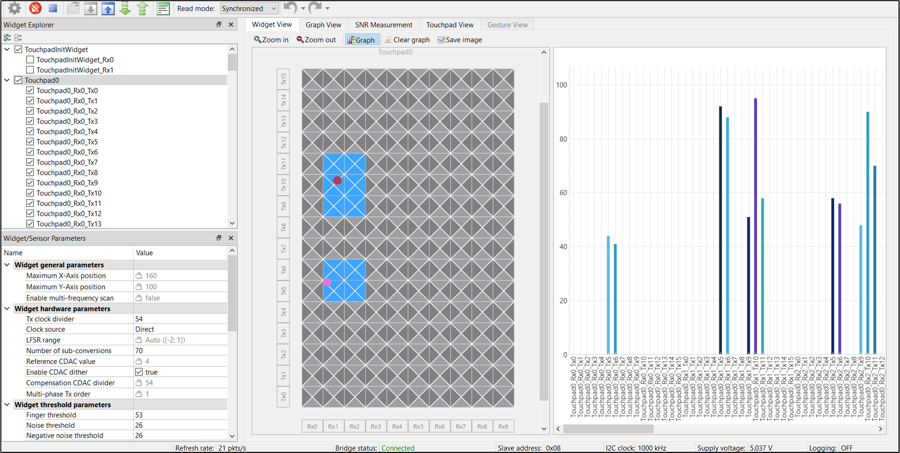
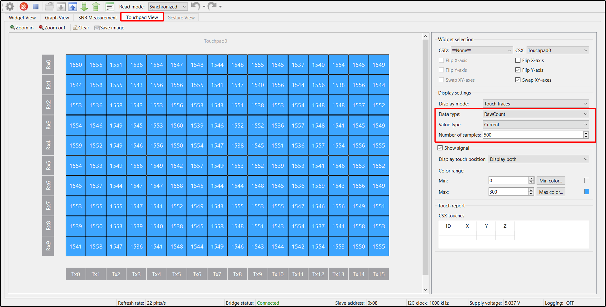
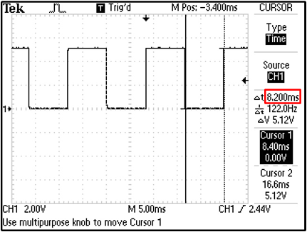

# PSoC&trade; 4: MSC multi-touch mutual-capacitance touchpad tuning

This code example demonstrates how to use the CAPSENSE&trade; middleware to detect two finger touch positions on a mutual-capacitance-based touchpad widget in PSoC&trade; 4 devices with multi sense converter (MSC).

In addition, this README also explains how to manually tune a mutual-capacitance-based touchpad for optimum performance with respect to parameters such as reliability, power consumption, response time, and linearity using the CSX-RM sensing technique and CAPSENSE&trade; tuner GUI. Here, CAPSENSE&trade; crosspoint (CSX) represents the mutual-capacitance sensing technique and RM represents the ratiometric method.

[View this README on GitHub.](https://github.com/Infineon/mtb-example-psoc4-msc-capsense-csx-touchpad-tuning)

[Provide feedback on this code example.](https://cypress.co1.qualtrics.com/jfe/form/SV_1NTns53sK2yiljn?Q_EED=eyJVbmlxdWUgRG9jIElkIjoiQ0UyMzIyNzUiLCJTcGVjIE51bWJlciI6IjAwMi0zMjI3NSIsIkRvYyBUaXRsZSI6IlBTb0MmdHJhZGU7IDQ6IE1TQyBtdWx0aS10b3VjaCBtdXR1YWwtY2FwYWNpdGFuY2UgdG91Y2hwYWQgdHVuaW5nIiwicmlkIjoic2FoZyIsIkRvYyB2ZXJzaW9uIjoiMi4wLjEiLCJEb2MgTGFuZ3VhZ2UiOiJFbmdsaXNoIiwiRG9jIERpdmlzaW9uIjoiTUNEIiwiRG9jIEJVIjoiSUNXIiwiRG9jIEZhbWlseSI6IlBTT0MifQ==)

## Requirements

- [ModusToolbox&trade; software](https://www.cypress.com/products/modustoolbox-software-environment) v2.4

  **Note:** This code example version requires ModusToolbox&trade; software version 2.4 and is not backward compatible with v2.3 or older versions.

- Board support package (BSP) minimum required version: 2.0.0
- Programming language: C
- Associated parts: [PSoC&trade; 4100S Max](https://www.cypress.com/documentation/datasheets/psoc-4-psoc-4100s-max-datasheet-programmable-system-chip-psoc)

## Supported toolchains (make variable 'TOOLCHAIN')

- GNU Arm® embedded compiler v10.3.1 (`GCC_ARM`) - Default value of `TOOLCHAIN`
- Arm&reg; compiler v6.13 (`ARM`)
- IAR C/C++ compiler v8.42.2 (`IAR`)


## Supported kits (make variable 'TARGET')

- [CY8CKIT-041S-MAX PSoC&trade; 4100S Max pioneer kit](https://www.cypress.com/documentation/development-kitsboards/psoc-4100s-max-pioneer-kit-cy8ckit-041s-max) (`CY8CKIT-041S MAX`) - Default target

## Hardware setup

This example uses the board's default configuration. See the [kit user guide](https://www.cypress.com/file/520036/download) to ensure that the board is configured correctly to VDDA at 5 V (J10 should be at position 1 and 2). If you are using the code example at a VDDA voltage other than 5 V, set up the device power voltages correctly to ensure proper operation of the device power domains.  See [Set up the VDDA supply voltage in Device configurator](#set-up-the-vdda-supply-voltage-in-device-configurator) for more details.

## Software setup

This example requires no additional software or tools.

## Using the code example

Create the project and open it using one of the following:

<details><summary><b>In Eclipse IDE for ModusToolbox&trade; software</b></summary>

1. Click the **New Application** link in the **Quick Panel** (or, use **File** > **New** > **ModusToolbox Application**). This launches the [Project Creator](https://www.cypress.com/ModusToolboxProjectCreator) tool.

2. Pick a kit supported by the code example from the list shown in the **Project Creator - Choose Board Support Package (BSP)** dialog.

   When you select a supported kit, the example is reconfigured automatically to work with the kit. To work with a different supported kit later, use the [Library Manager](https://www.cypress.com/ModusToolboxLibraryManager) to choose the BSP for the supported kit. You can use the Library Manager to select or update the BSP and firmware libraries used in this application. To access the Library Manager, click the link from the **Quick Panel**.

   You can also just start the application creation process again and select a different kit.

   If you want to use the application for a kit not listed here, you may need to update the source files. If the kit does not have the required resources, the application may not work.

3. In the **Project Creator - Select Application** dialog, choose the example by enabling the checkbox.

4. (Optional) Change the suggested **New Application Name**.

5. The **Application(s) Root Path** defaults to the Eclipse workspace which is usually the desired location for the application. If you want to store the application in a different location, you can change the *Application(s) Root Path* value. Applications that share libraries should be in the same root path.

6. Click **Create** to complete the application creation process.

For more details, see the [Eclipse IDE for ModusToolbox&trade; software user guide](https://www.cypress.com/MTBEclipseIDEUserGuide) (locally available at *{ModusToolbox&trade; software install directory}/ide_{version}/docs/mt_ide_user_guide.pdf*).

</details>

<details><summary><b>In command-line interface (CLI)</b></summary>

ModusToolbox&trade; software provides the Project Creator as both a GUI tool and the command line tool, "project-creator-cli". The CLI tool can be used to create applications from a CLI terminal or from within batch files or shell scripts. This tool is available in the *{ModusToolbox&trade; software install directory}/tools_{version}/project-creator/* directory.

Use a CLI terminal to invoke the "project-creator-cli" tool. On Windows, use the command line "modus-shell" program provided in the ModusToolbox&trade; software installation instead of a standard Windows command-line application. This shell provides access to all ModusToolbox&trade; software tools. You can access it by typing `modus-shell` in the search box in the Windows menu. In Linux and macOS, you can use any terminal application.

This tool has the following arguments:

Argument | Description | Required/optional
-----------|-------------|-----------
`--board-id` | Defined in the `<id>` field of the [BSP](https://github.com/Infineon?q=bsp-manifest&type=&language=&sort=) manifest | Required
`--app-id`   | Defined in the `<id>` field of the [CE](https://github.com/Infineon?q=ce-manifest&type=&language=&sort=) manifest | Required
`--target-dir`| Specify the directory in which the application is to be created if you prefer not to use the default current working directory | Optional
`--user-app-name`| Specify the name of the application if you prefer to have a name other than the example's default name | Optional
<br>

The following example will clone the "[CAPSENSE&trade; MSC CSX touchpad tuning](https://github.com/Infineon/mtb-example-psoc4-msc-capsense-csx-touchpad-tuning)" application with the desired name "MSCCSXTouchpadTuning" configured for the *CY8CKIT-041S-MAX* BSP into the specified working directory, *C:/mtb_projects*:

   ```
   project-creator-cli --board-id CY8CKIT-041S-MAX --app-id mtb-example-psoc4-msc-capsense-csx-touchpad-tuning --user-app-name MSCCSXTouchpadTuning --target-dir "C:/mtb_projects"
   ```

**Note:** The project-creator-cli tool uses the `git clone` and `make getlibs` commands to fetch the repository and import the required libraries. For details, see the "Project creator tools" section of the [ModusToolbox&trade; software user guide](https://www.cypress.com/ModusToolboxUserGuide) (locally available at *{ModusToolbox&trade; software install directory}/docs_{version}/mtb_user_guide.pdf*).

</details>

<details><summary><b>In third-party IDEs</b></summary>

Use one of the following options:

- **Use the standalone [Project Creator](https://www.cypress.com/ModusToolboxProjectCreator) tool:**

   1. Launch Project Creator from the Windows Start menu or from *{ModusToolbox&trade; software install directory}/tools_{version}/project-creator/project-creator.exe*.
   2. In the initial **Choose Board Support Package** screen, select the BSP and click **Next**.
   3. In the **Select Application** screen, select the specific IDE from the **Target IDE** drop-down menu.
   4. Click **Create** and follow the instructions printed in the bottom pane to import or open the exported project in the respective IDE.

<br> 

- **Use command-line interface (CLI):**

   1. Follow the instructions from the **In command-line interface (CLI)** section to create the application, and import the libraries using the `make getlibs` command.

   2. Export the application to a supported IDE using the `make <ide>` command.

   3. Follow the instructions displayed in the terminal to create or import the application as an IDE project.

For a list of supported IDEs and more details, see the "Exporting to IDEs" section of the [ModusToolbox&trade; software user guide](https://www.cypress.com/ModusToolboxUserGuide) (locally available at *{ModusToolbox&trade; software install directory}/docs_{version}/mtb_user_guide.pdf*).

</details>

The project already has the necessary settings by default, so you can go to the [Operation](#operation) section to verify the operation. If you want to understand the tuning process and follow the stages for this kit or your own board, go to [Tuning procedure](#tuning-procedure) and then test it using the [Operation](#operation) section.

## Operation

1. Connect the FFC cable between J9 on PSoC&trade; 4100S Max pioneer board and J2 on capacitive sensing expansion board. Power the device by plugging a USB 2.0 Type-A to Micro-B cable on J8 (USB Micro-B connector).

   **Figure 1. Connecting the CY8CKIT-041S-MAX kit with capacitive sensing expansion board to a PC**

   

2. Program the board using one of the following:

   <details><summary><b>Using Eclipse IDE for ModusToolbox&trade; software</b></summary>

      1. Select the application project in the Project Explorer.

      2. In the **Quick Panel**, scroll down, and click **\<Application Name> Program (KitProg3_MiniProg4)**.
   </details>

   <details><summary><b>Using CLI</b></summary>

     From the terminal, execute the `make program` command to build and program the application using the default toolchain to the default target. You can specify a target and toolchain manually:
      ```
      make program TARGET=<BSP> TOOLCHAIN=<toolchain>
      ```

      Example:
      ```
      make program TARGET=CY8CKIT-041S-MAX TOOLCHAIN=GCC_ARM
      ```
   </details>

<br>

3. After programming, the application starts automatically.

4. To test the application, slide your finger over the CAPSENSE&trade; Touchpad and notice that the user LED turns ON when touched and turns OFF when the finger is lifted.

5. You can also monitor the CAPSENSE&trade; data using the CAPSENSE&trade; tuner application as follows:

### Monitor data using the CAPSENSE&trade; tuner

1. Open CAPSENSE&trade; tuner from the **Tools** section in the IDE Quick Panel.

   You can also run the CAPSENSE&trade; tuner application standalone from *{ModusToolbox&trade; software install directory}/ModusToolbox/tools_{version}/capsense-configurator/capsense-tuner*. In this case, after opening the application, select **File** > **Open** and open the *design.cycapsense* file of the respective application, which is present in the *{Application root directory}/COMPONENT_CUSTOM_DESIGN_MODUS/TARGET_\<BSP-NAME>* folder.

   See the [ModusToolbox&trade; software user guide](https://www.cypress.com/ModusToolboxUserGuide) (locally available at *{ModusToolbox install directory}/docs_{version}/mtb_user_guide.pdf*) for options to open the CAPSENSE&trade; tuner application using the CLI.

2. Ensure that the kit is in CMSIS-DAP bulk mode (KitProg3 status LED is ON and not blinking). See [Firmware-loader](https://github.com/Infineon/Firmware-loader) to learn on how to update the firmware and switch modes in KitProg3.

3. In the tuner application, click on the **Tuner Communication Setup** icon or select **Tools** > **Tuner Communication Setup**. In the window that appears, select the I2C checkbox under KitProg3 and configure as follows:

   - **I2C address:** 8
   - **Sub-address:** 2 bytes
   - **Speed (kHz):** 1000

   These are the same values set in the EZI2C resource.

   **Figure 2. Tuner communication setup parameters**

   

4. Click **Connect** or select **Communication** > **Connect** to establish a connection.

5. Click **Start** or select **Communication** > **Start** to start data streaming from the device.

   The tuner displays the data from the sensor in the **Widget View**, **Graph View**, and **Touchpad View** tabs.

6. Set the **Read Mode** to the synchronized mode. Under the **Widget View** tab, you can see the touchpad widget sensors highlighted when you touch it.

   **Figure 3. Widget view of the CAPSENSE&trade; tuner**

   

7. You can view the raw count, baseline, difference count for each sensor and also the touchpad position in the **Graph View** tab. For example, to view the sensor data for a single sensor in Touchpad 0, select **Touchpad0_Rx0_Tx0** under **Touchpad0**.

   **Figure 4. Graph view of the CAPSENSE&trade; tuner**

   

8. The **Touchpad View** tab shows the heat map view; it visualizes the finger movement.

   **Figure 5. Touchpad view of the CAPSENSE&trade; tuner**

   

9. Observe the **Widget/Sensor Parameters** section in the CAPSENSE&trade; tuner window. The Compensation CDAC values for each touchpad sensor element calculated by the CAPSENSE&trade; resource is displayed as shown in **Figure 14**.
()
10. Verify that the SNR is greater than 5:1 by following the steps given in **Stage 4** starting with **Step 6** in the [Tuning procedure](#tuning-procedure).

The linearity of the position graph, non-reporting of false touches, and no discontinuity in the line drawing indicate a proper tuning.

## Tuning procedure

<details><summary><b> Create custom BSP for your board </b></summary>

1. Create a custom BSP for your board having any device, by following the steps given in [KBA231373](https://community.cypress.com/t5/Knowledge-Base-Articles/ModusToolbox-2-2-and-later-Make-a-Custom-BSP-KBA231373/ta-p/251107).In this code example, it was created for the device "“CY8C4149AZI-S598”.

2. Open the *design.modus* file from *{Application root directory}/TARGET_\<BSP-NAME>/COMPONENT_BSP_DESIGN_MODUS* folder obtained in the previous step and enable CAPSENSE&trade; to get *design.cycapsense* file. CAPSENSE&trade; configuration can then be started from scratch as explained below.

</details>

The following steps explain the tuning procedure.

**Note:** See the section **Selecting CAPSENSE&trade; hardware parameters** in the [AN85951 – PSoC&trade;4 and PSoC&trade;6 MCU CAPSENSE&trade; design guide](https://www.cypress.com/an85951) to learn about the considerations for selecting each parameter values.

**Figure 6. CSX touchpad widget tuning flow**


Do the following to tune the touchpad:

<details><summary><b> Stage 1. Set the initial hardware parameters</b></summary>

1. Connect the board to your PC using the provided USB cable through the KitProg3 USB connector.

2. Launch the Device configurator tool.

   You can launch the Device configurator in the Eclipse IDE for ModusToolbox&trade; software from the **Tools** section in the IDE Quick Panel.

   You can also launch it in stand-alone mode from *{ModusToolbox&trade; install directory}/ModusToolbox/tools_{version}/device-configurator/device-configurator*. In this case, after opening the application, select **File** > **Open** and open the *design.modus* file of the respective application, which is present in the *{Application root directory}/COMPONENT_CUSTOM_DESIGN_MODUS/TARGET_\<BSP-NAME>* folder.

   **Note:** If you are using the custom BSP with the empty PSoC™ 4 starter application, use *{Application root directory}/TARGET_\<BSP-NAME>/COMPONENT_BSP_DESIGN_MODUS* folder to open the *design.modus* file.

3. In the [CY8CKIT-041S MAX kit](https://www.cypress.com/documentation/development-kitsboards/psoc-4100s-max-pioneer-kit-cy8ckit-041s-max), the touchpad pins are connected to both channel 0 and channel 1. Therefore, make sure that you enable channel 0 and channel 1 in the Device configurator as shown in **Figure 7**.

   **Figure 7. Enable MSC channels in Device configurator**

   

   Save the changes and close the window.

4. Launch the CAPSENSE&trade; configurator tool.

   You can launch the CAPSENSE&trade; configurator tool in Eclipse IDE for ModusToolbox&trade; from the CAPSENSE&trade; peripheral setting in the Device configurator, or directly from the **Tools** section in the IDE Quick Panel.

   You can also launch it in stand-alone mode from *{ModusToolbox&trade; software install directory}/ModusToolbox/tools_{version}/capsense-configurator/capsense-configurator*. In this case, after opening the application, select **File** > **Open** and open the *design.cycapsense* file of the respective application, which is present in the *{Application root directory}/COMPONENT_CUSTOM_DESIGN_MODUS/TARGET_\<BSP-NAME>* folder.

   **Note:** If you are using the custom BSP with the empty PSoC™ 4 starter application, use *{Application root directory}/TARGET_\<BSP-NAME>/COMPONENT_BSP_DESIGN_MODUS* folder to open the *design.cycapsense* file.

   See the [ModusToolbox&trade; CAPSENSE&trade; configurator tool guide](https://www.cypress.com/ModusToolboxCapSenseConfig) for step-by-step instructions on how to configure and launch CAPSENSE&trade; in ModusToolbox&trade; software.

5. In the **Basic** tab, note that a touchpad **Touchpad0** is configured as **CSX RM (Mutual-cap)**.

   Also add a button **TouchpadInitWidget** (with 1 Tx and 2 Rx) configured as the **CSX RM** sensing mode and move the widget to the top by clicking on **Move up** to be added to empty initialization slots as explained below.

   **Note:** 

   - For sensors using **CSX RM** sensing mode with **CTRLMUX** as sensor connection method, initialization requires empty slots to be added. This is the work-around to the errata mentioned in the PSoC&trade; 4100S Max datasheet. 

   - Choose **Inactive sensor connection** as **VDDA/2** and ensure to add empty scan slots before the first sensor scan (on both channel 0 and channel 1) for initializing the voltages on Rx lines to VDDA/2. This will be set in **Step 7**.

   - The Tx and Rx of the button can be ganged with any Tx and Rx pins of the respective channel of the touchpad. This will be configured in **Step 9**. 

   **Figure 8. CAPSENSE&trade; configurator - Basic tab**

   

6. Do the following in the **General** sub-tab under the **Advanced** tab:

   - Set **Scan mode** as **CS-DMA** to enable autonomous scanning.

     For applications with large number of sensors like trackpad, automated scan using DMA is helpful for scanning multiple sensors autonomously which helps in improved refresh rate and offloading the CPU.

     Ensure that you do the required DMA settings in the **Device configurator** as described in the [KBA233869 - DMA connection settings for CS-DMA mode](https://www.cypress.com/KBA233869).

   - **Sensor connection method** is **CTRLMUX** by default for CS-DMA scan mode.

     Use CTRLMUX if your schematic has all the sensors on ctrlmux pins. CTRLMUX mode allows the MSC block to control the GPIO pins and removes the need of AMUXBUS to transfer CAPSENSE&trade; signals between GPIO and the MSC block.

   - Set **Modulator clock divider** as **1** to obtain the maximum available modulator clock frequency as recommended in the [AN85951 – PSoC&trade;4 and PSoC&trade;6 MCU CAPSENSE&trade; design guide](https://www.cypress.com/an85951).

       **Note:** The modulator clock frequency can be set to 48,000 kHz only after changing the IMO clock frequency to 48 MHz, because the modulator clock is derived from the IMO clock. Do the following:

       1. Under the **System** tab in the **Device Configurator** tool, select **System Clocks** > **Input** > **IMO**. 
    
       2. Select **48** from the **Frequency(MHz)** drop-down list.
   
   - **Number of init sub-conversions** is set based on the hint shown when you hover over the edit box. Retain default value (will be set in **Stage 4**)

   - Check the **Enable self-test library** selection. This is required for sensor capacitance measurement Using BIST.

   - Retain the default settings for all filters. You can enable the filters later depending on the signal-to-noise ratio (SNR) requirements in **Stage 5**.

     Filters are used to reduce the peak-to-peak noise. Using filters will result in higher scan time.

   **Figure 9. CAPSENSE&trade; configurator - General sub-tab in the Advanced tab**

   

      **Note:** Each tab has a button **Restore Defaults** to restore the parameters of that tab to their default values.

7. Go to the **CSX Settings** tab and make the following changes:

   - Set **Inactive Sensor connection** as **VDDA/2** as explained in **Step 1**.

   - Set **Number of reported fingers** as **2** for two-finger detection.

   - Select **Enable CDAC auto-calibration** and **Enable compensation CDAC**.

     This helps in achieving the required CDAC calibration levels (40% of maximum count) for all sensors in the widget while maintaining the same sensitivity across the sensor elements.

   **Figure 10. CAPSENSE&trade; configurator - CSX Settings tab under the Advanced tab**

   

8. Go to the **Widget Details** tab. 

   Select **Touchpad0** from the left pane, and then set the following:

   - **Maximum X-Axis position** and **Maximum Y-Axis position** to **160** and **100**, respectively, as it is a 16*10 touchpad.

   - **Tx clock divider:** Retain Default value (will be set in **Stage 3**)

   - **Clock source:** Direct

      **Note:** Spread spectrum clock (SSC) or PRS clock can be used as a clock source to deal with EMI/EMC issues. The selected value should be set using the **Widget Details** tab in the CAPSENSE&trade; configurator.

   - **Number of sub-conversions:** 70

     70 is a good starting point to ensure a fast scan time and sufficient signal. This value will be adjusted as required in **Stage 5**.

   - Select **Enable CDAC dither** 

   - **Finger Threshold:** 20

     Finger Threshold is initially set to a low value, which allows the *Touchpad View* to track the finger movement during tuning.

   - **Noise Threshold:** 10

   - **Negative Noise Threshold:** 10 

   - **Hysteresis:** 5

     These values reduces the influence of baseline on the sensor signal, which helps to get the true difference-count. Retain the default values for all other threshold parameters; these parameters are set in **Stage 6**.

   Select **TouchpadInitWidget** from the left pane, and then set the following:

   - **Tx clock divider:** Retain Default value (will be set in **Stage 3**)

   - **Clock source:** Direct

      **Note:** Spread spectrum clock (SSC) or PRS clock can be used as a clock source to deal with EMI/EMC issues. The selected value should be set using the **Widget Details** tab in the CAPSENSE&trade; configurator.

   - **Number of sub-conversions:** 1

      1 sub-conversion is sufficient to initialize the Touchpad widget.

   - Select **Enable CDAC dither** 

   **Figure 11. CAPSENSE&trade; configurator - Touchpad details in Widget details tab under the Advanced tab**

   

   **Figure 12. CAPSENSE&trade; configurator - TouchpadInitWidget details in the Widget details tab under the Advanced tab**

   

9. Go to the **Scan Configuration** tab to select the pins and scan slots. 

   Do the following:

   Configure the button **TouchpadInitWidget**: 
   
   1. Configure channels for the Tx and Rx electrodes using the drop-down menu.

   Here, Tx0 is configured with **MSC1** and Rx0 and Rx1 are configured with **MSC1** and **MSC0** respectively.
   
   2. Configure pins for the electrodes using the drop-down menu.
   
   Here, the Tx of the button is ganged with the Tx1 of the touchpad, Rx0 is ganged with Rx0 of the Touchpad and Rx1 is ganged with Rx5 of the Touchpad.
   
   Configure the **Touchpad** widget:

   1. Configure channels for the Tx and Rx electrodes using the drop-down menu.

      The Rx and Tx pins are divided equally between **MSC0** and **MSC1**.

   2. Configure pins for the electrodes using the drop-down menu.

   Configure the scan slots for both the widgets using the **Auto-Assign Slots** option.

   The summary section in the **Scan configuration** tab shows 81 scan slots (for 162 sensors), with each channel scanning in each slot simultaneously. This helps to perform parallel scanning and reduces the total scan time. 

   - Each sensor is allotted a scan slot based on the slot number.

   - The slots are assigned such that the sensors which are under parallel scanning are as far as possible from each other.

     See [AN85951 – PSoC&trade;4 and PSoC&trade;6 MCU CAPSENSE&trade; design guide](https://www.cypress.com/an85951) for more details on scan slot allotment rules. 

   - Check the notice list for warning or errors.

      **Figure 13. Scan configuration tab**

      

10. Click **Save** to apply the settings.

</details>

<details><summary><b> Stage 2. Measure the parasitic capacitance (Cp) </b></summary>

To determine the maximum Tx/Rx Cp, measure the Cp of each Tx and Rx sensor element of the touchpad, between the sensor electrode (sensor pin) and device ground, using an LCR meter or using the built-in-self-test (BIST) library.

It can also be estimated by back-calculating for Cs (Sensor capacitance) using the CSD-RM Raw Count equation. See the **Equation CSD-RM Raw Count** in [AN85951 – PSoC&trade;4 and PSoC&trade;6 MCU CAPSENSE&trade; design guide](https://www.cypress.com/an85951) for the Raw Count equation.

**Measure sensor capacitance using BIST:**

Use the `Cy_CapSense_MeasureCapacitanceSensorElectrode()` API to measure the parasitic capacitance (Cp) of each touchpad sensor to determine the maximum Cp out of all the sensors. 

If you are using the empty PSoC™ 4 starter application, you can copy the respective source code, from this example’s *main.c* file to the *main.c* file of the application project. If you are using this code example, the required files are already in the application.

Do the following to determine the Cp values in debug mode:

1. Program the board in debug mode.

   In the IDE, use the **\<Application Name> Debug (KitProg3)** configuration in the **Quick Panel**.
   
   For more details, see the "Program and debug" section in the Eclipse IDE for ModusToolbox&trade; software user guide: *{ModusToolbox&trade; software install directory}/ide_{version}/docs/mt_ide_user_guide.pdf*.

2. Place a breakpoint after the capacitance measurement.

3. In the **Expressions** window, add the Cp measurement variable: `sense_cap`. 

   The status of the measurement can also be read through the return value `measure_status` in the **Expressions** window.

4. Click the **Resume** button (green arrow) to reach the breakpoint. 

   Note that the function return values read `CY_CAPSENSE_BIST_SUCCESS_E` and the measurement variables provide the capacitance of the sensor elements in *femtofarads*.

   **Figure 14. Sensor capacitance measurement values obtained in debug mode**

   

5. Click the **Terminate** button (red box) to exit debug mode.

   **Table 1. Cp values obtained for CY8CKIT-041S-MAX kit**

   | Kit     | Maximum Rx parasitic capacitance (C<sub>P_Col</sub>) in pF | Maximum Tx parasitic capacitance (C<sub>P_Row</sub>) in pF |
   |:---------------------|:----------------------------------------| :-----|
   | CY8CKIT-041S-MAX kit            |     36           | 44 |

</details>

<details><summary><b> Stage 3. Calculate the Tx clock frequency </b></summary>

1. Calculate the Tx clock frequency using **Equation 1**.

   **Equation 1. Max Tx clock frequency**

   

   Where,
   - F<sub>Tx</sub> is the Tx clock frequency.

   - C<sub>P_Tx</sub> and C<sub>P_Rx</sub> are the maximum parasitic capacitance of the Tx and Rx electrodes respectively.

   - R<sub>SeriesTotal</sub> is the maximum total series resistance, which includes the 525-ohm internal resistance, the external series resistance (in CY8CKIT-041S-MAX, it is 2 kilo-ohm), and the trace resistance. Include the trace resistance if high-resistive material such as ITO or conductive ink is used. The external resistor is connected between the sensor pad and the device pin to reduce the radiated emission. ESD protection is built into the device.

   **Note 1:** If LCR meter is not available, set an initial Tx clock divider value and look at the charge and discharge waveforms of the sensor electrodes and iteratively change the divider using the CAPSENSE&trade; tuner and set a maximum frequency such that it completely charges and discharges in each phase of the MSC CSX sensing method.

   **Note 2:** The maximum frequency set should charge and discharge the sensor completely, which you can verify using an oscilloscope and an active probe. To view the charging and discharging waveforms of the sensor, probe at the sensors (or as close as possible to the sensors), and not at the pins or resistor.

   **Note 3:** **Figure 15** shows the waveforms when the sensor is not fully charging and discharging:

   **Figure 15. Incomplete charging and discharging**
   
   

2. Ensure that the following conditions are also satisfied when selecting the Tx clock frequency and CDAC compensation divider:

   - The auto-calibrated CDAC and compensation CDAC value should lie in the valid range for the selected Tx clock divider and CDAC compensation divider. This should be verified once the initial hardware parameters are loaded into the device. See **Step 3** (*Ensure that the auto-calibrated CDAC is within the recommended range*) of **Stage 4** for more details.

   - If you are explicitly using the PRS or SSCx clock source for EMI/EMC tests, ensure that you select the Tx clock frequency that meets the conditions mentioned in the [ModusToolbox&trade; CAPSENSE&trade; configurator guide](https://www.cypress.com/file/492896/download) in addition to the above conditions. PRS and SSCx techniques spread the frequency across a range. The maximum frequency set should charge and discharge the sensor completely, which you can verify using an oscilloscope and an active probe.

   - If you want to scan Channel 0 and Channel 1 in the same scan slot simultaneously, the Tx clock divider and the number of sub-conversions should be the same for both the sensor elements.

   **Table 2. Tx clock frequency settings for CY8CKIT-041S-MAX**

   | Kit | R<sub>SeriesTotal</sub> (kΩ) | Cp (pF) | Maximum Tx clock frequency (kHz) | Actual Tx clock frequency (kHz) |
   | :--------- | :------------    | :------------ | :---- | :---- |
   | CY8CKIT-041S-MAX | 2525 | 44 | 900 | 888 |

   **Note 1:** Actual Tx clock frequency value is choosen such that the divider is divisible by 2, in order to have the 2 scan phases for equal durations. 

    **Note 2:** The Tx clock divider value, as given by **Equation 2**, is obtained by dividing HFCLK (48 MHz) by **Maximum Tx clock frequency (kHz)** calculated in **Stage 3** (see **Table 2**) and choosing the nearest ceiling sense clock divider option in the configurator.
      
      **Equation 2. Tx clock divider**

      

      In this case, Tx clock divider = 48000/888 = 54.

   Set the calculated value for both widgets **TouchpadInitWidget** and **Touchpad0** using the steps given in **Step 8** in **Stage 1**, which ensures the maximum possible sense clock frequency (for good gain) while allowing the sensor capacitance to fully charge and discharge in each phase of the MSC CSX sensing method. 

</details>

<details><summary><b> Stage 4: Obtain the cross-over point and noise </b></summary>

1. Program the board.

2. Check the calibration pass/fail status from the return value of the `Cy_CapSense_Enable()` function. 

3. Launch the CAPSENSE&trade; tuner to monitor the CAPSENSE&trade; data and for CAPSENSE&trade; parameter tuning and SNR measurement.

   See the [CAPSENSE&trade; tuner guide](https://www.cypress.com/ModusToolboxCapSenseTuner) for step-by-step instructions on how to launch and configure the CAPSENSE&trade; tuner in ModusToolbox&trade; software.

4. Ensure that the auto-calibrated CDAC is within the recommended range.

   **Note:** Calibration may fail if the obtained rawcounts is not within the targetted range. 

   As discussed in **Step 2** of **Stage 2**, the Tx clock divider will be tuned to bring the CDAC values to the recommended range in this step.

   - Click **Touchpad0** in the **Widget Explorer** to view the Reference CDAC value in the sensor parameters window as shown in **Figure 17**.

   - Also, click each sensor element (*Touchpad0_Rx0_Tx0* for example) in the **Widget Explorer** to view the Compensation CDAC in the sensor parameters window as shown in **Figure 16**.

     **Figure 16. CDAC value**

     

   - If the reference CDAC value is within the range (10/Compensation CDAC Divider) to 255 and Compensation CDAC values are in the range 1 to 255, the following step is not required.

     **Note:** If the reference CDAC value is equal to 1, ensure that the Compensation CDAC values are greater than or equal to 98.

   See the [AN85951 – PSoC&trade;4 and PSoC&trade;6 MCU CAPSENSE&trade; design guide](https://www.cypress.com/an85951) for the recommended guidelines on valid CDAC range (with and without compensation enabled) to result in calibration PASS across multiple boards because of board-to-board variations.

5. Fine-tune the Tx clock divider to bring the CDAC value within range.

   From **Equation CSX-RM Raw Count** in [AN85951 – PSoC&trade;4 and PSoC&trade;6 MCU CAPSENSE&trade; design guide](https://www.cypress.com/an85951), it is evident that increasing the Tx clock divider will decrease the reference CDAC value for a given calibration percent and vice versa.

   1. If the Reference CDAC value is not in the recommended range, increase the Tx clock divider in the Widget Hardware Parameters window.

   2. Click **To Device** to apply the changes to the device as shown in **Figure 17**.

   3. Click each sensor element, for instance, **Touchpad0_Rx0_Tx0** in the Widget Explorer.

   4. Observe the Compensation CDAC value in the **Sensing Parameters** section of the Widget/Sensor Parameters window.

   5. Click **To Device** to apply the changes to the device as shown in **Figure 17**.

      **Figure 17. Apply changes to device**

      

   6. If the CDAC values are still not in the required range, reduce the modulator clock frequency to the next lower value.

   7. Repeat steps 1 to 6 until you obtain Reference CDAC values in the range (10/Compensation CDAC Divider) to 255 and Compensation CDAC values are in the range 1 to 255.

      **Note:** As **Figure 16** shows, CDAC values are already in the recommended range. Therefore, you can leave the Tx clock divider to the value as shown in **Step 2** of **Stage 3**.

4. Calculate and set the **Number of init sub-conversions** using **Equation 3** and following the steps given in **Step 6** in **Stage 1**, with the values of SenseClockDivider and Reference CDAC value obtained.

   **Equation 3: Number of init sub-conversions** 

   

      where,

      VDDA = 5 V

      Tx Clock Divider - Calculated in **Stage 3**

      Cref<sub>code</sub> - Reference CDAC code obtained in **Step 4**.

      **Note:** **Equation 3** is considering the default values of Cmod=2.2nF, Base % = 0.5 (50%), Clsb = 8.86 fF. If you intend to change any value, see the [AN85951 – PSoC&trade; 4 and PSoC&trade; 6 MCU CAPSENSE&trade; design guide](https://www.cypress.com/an85951) to calculate the required number of init sub-conversions.

   Here, Tx Clock Divider = 54, Reference CDAC = 4, VDDA = 5V. From **Equation 3**, Number of init-sub conversions = 3.

Set this value in the CAPSENSE&trade; configurator. Then, re-program and open the tuner.

7. Capture the raw counts of each sensor element in the touchpad (as shown in **Figure 18**) and verify that they are approximately (+/- 5%) equal to 40% of the MaxCount. See **Equation CSX-RM Raw Count** in [AN85951 – PSoC&trade;4 and PSoC&trade;6 MCU CAPSENSE&trade; design guide](https://www.cypress.com/an85951)) for the MaxCount equation.

   1. Go to the **Touchpad View** tab and change the **Display settings** as follows:

      - **Data type:** RawCount

      - **Value type:** Current

      - **Number of samples:** 500

    **Figure 18. Raw counts obtained on the Touchpad View tab in the tuner window**

     

8. Capture and note the peak-to-peak noise of each sensor element in the touchpad.

   1. From the **Widget Explorer** section, select the  **Touchpad0** widget.

   2. Go to the **Touchpad View** tab and change the **Display settings** as follows:

      - **Display mode:** Touch Reporting

      - **Data type:** RawCount

      - **Value type:** Max-Min

      - **Number of Samples:** 500

      Capture the variation in the raw counts for 500 samples, without placing a finger (which gives the peak-to-peak noise) and note the highest noise.

      **Note:** Under **Widget selection**, enable **Flip Y-axis** and **Swap XY-axes** for proper visualization of finger movement on the touchpad.

      **Figure 19. Noise obtained on the Touchpad View tab in the tuner window**

      

      **Table 3. Max peak-to-peak noise obtained in CY8CKIT-041S-MAX**

      |Kit | Max peak-to-peak noise|
      |:----------|:-------------------------|
      |CY8CKIT-041S-MAX   |11|

9. Firmly hold the finger (typically 8 mm or 9 mm) on the touchpad in the least touch intensity (LTI) position (at the intersection of four nodes) as shown below. See [AN85951 – PSoC&trade; 4 and PSoC&trade; 6 MCU CAPSENSE&trade; design guide](https://www.cypress.com/an85951) for more details on the LTI position.

   **Figure 20. Least touch intensity (LTI) position**

   

   **Note:** Finger movement during the test can artificially increase the noise level.

   1. Go to the **Touchpad View** tab and change the **Display settings** as follows:

      - **Display mode:** Touch Reporting

      - **Data type:** DiffCount

      - **Value type:** Current

   2. Place the finger such that an almost equal signal is obtained in all four intersecting nodes (look at the heat map displayed in the **Touchpad View** tab as shown in **Figure 18**).

      **Note:** The LTI signal is measured at the farthest point of the track pad from the sensor pin connection, where the sensors have the worst-case RC-time constant.

      **Figure 21. LTI position in touchpad view**

      

      LTI Signal = (67 + 67 + 66 + 70)/4 = 67

</details>

<details><summary><b> Stage 5. Use the CAPSENSE&trade; tuner to fine-tune the sensitivity for 5:1 SNR </b></summary>

The CAPSENSE&trade; system may be required to work reliably in adverse conditions such as a noisy environment. The touchpad sensors need to be tuned with SNR > 5:1 to avoid triggering false touches and to make sure that all intended touches are registered in these adverse conditions.

**Note:** For gesture detection, it is recommended to have approximately 10:1 SNR.

1. Ensure that the LTI Signal count is greater than 50 and meets at least 5:1 SNR (using **Equation 4**).

   In the **CAPSENSE&trade; Tuner** window, increase the **Number of sub-conversions** (located in the **Widget/Sensor Parameters** section, under **Widget Hardware Parameters**) by 10 until you achieve this requirement.

   **Equation 4: Measuring the SNR**

   

   Where,

   - LTI signal is the signal obtained as shown in **Figure 21**

   - Pk-Pk noise is the peak-to-peak noise obtained as shown in **Figure 19**

   SNR is measured using **Equation 4**.

   Here, from **Figure 19** and **Figure 21**,

   SNR = 67/ 11 = 6

   **Note:** Ensure that the **Number of sub-conversions** (Nsub) does not exceed the max limit and saturate the raw count.

2. Use **Equation 5** to calculate the maximum number of sub-conversions:

   **Equation 5: Max number of sub-conversions**

   

   Max Nsub = 65536/54 = 1213 [16-bit counter]

   Nsub is also tuned to satisfy the refresh rate that is required.

   **Equation 6. Scan time**

   

   **Note:** Total scan time is equal to the sum of initialization time and the scan time given by **Equation 6**.

3. After changing the **Number of sub-conversions**, click **Apply to Device** to send the setting to the device. The change is reflected in the graphs.

   **Note:** The **Apply to Device** option is enabled only when the *Number of sub-conversions* is changed.

4. If the SNR condition is not achieved even with the maximum number of sub-conversions, enable filters in the **General** settings (go to the **Advanced** tab of the CAPSENSE&trade; configurator). This is generally not required for this kit.

#### **Verify the refresh rate and response time**

Response time of the touchpad can be visualized using LEDs to indicate toggling of sensor GPIOs when touched.

Refresh rate is a combination of the sensor initialization time, scan time (given by **Equation 6**), processing time, and the tuner communication time, which can be verified using the tuner as shown in **Figure 22**:

**Figure 22. Measuring the refresh rate**


You can also measure the refresh rate by toggling one of the GPIOs in each sensor scan loop. Probing the GPIO (P10.4 on J3) on the oscilloscope shows the refresh rate as shown in **Figure 23**.

**Figure 23. Probing GPIO for the refresh rate**



**Note:** Refresh rate obtained here is with the tuner closed, because the tuner is used only for debugging and will not play a role in deciding the refresh rate in the end application.

The refresh rate from **Figure 23** = 1 /8.2 ms = 121 Hz

</details>

<details><summary><b> Stage 6: Use the CAPSENSE&trade; tuner to tune threshold parameters </b></summary>

After confirming that your design meets the timing parameters, and the SNR is greater than 5:1, set your threshold parameters.

**Note:** Thresholds are set based on the LTI position, because it is the least valid touch signal that can be obtained.

Set the recommended threshold values for the Touchpad widget using the LTI signal value obtained in **Stage 5**:

   - **Finger Threshold:** 80% of the LTI signal

   - **Noise Threshold:** Twice the highest noise or 40% of the LTI signal (whichever is greater)

   - **Negative Noise Threshold:** Twice the highest noise or 40% of the LTI signal (whichever is greater)

   - **Hysteresis**

      Do the following:

      1. Place the finger in the LTI position.

      2. Set the **Data type** to DiffCount and **Value type** to Max-Min in the **Touchpad View** tab.

      3. Record the maximum count value (Max_Count) of the selected 2x2 sensors.

         **Figure 24. Obtaining the hysteresis**

         

   - **Hysteresis:** Max_Count/2 = 12/2 = 6

   - **ON Debounce:** Default value of 3 (Set to 1 for gesture detection)

   - **Low Baseline Reset:** Default value of 30

   - **Velocity:** Default value of 2500

   **Note:** For multiple finger detection, if the velocity value is low, two touches at different positions are considered to be two different finger touches. On the other hand, if it is set at a higher value, it is considered to be the same finger moving to a different position.

   **Table 4. Software tuning parameters obtained for CY8CKIT-041S-MAX**

   |Parameter|	CY8CKIT-041S-MAX|
   |:--------|:------|
   |Number of Sub-conversions	|	70	|
   |Finger threshold 	|	53|
   |Noise threshold |26|
   |Hysteresis	| 6|
   |ON debounce	|3|
   |Low baseline reset	| 30|
   |Negative noise threshold	| 26|
   |Velocity| 2500|

#### **Apply settings to firmware**

1. Click **Apply to Device** and **Apply to Project** in the CAPSENSE&trade; Tuner window to apply the settings to the device and project, respectively. Close the tuner.

   **Figure 25. Apply to Project**

   

    The change is updated in the *design.cycapsense* file and reflected in the CAPSENSE&trade; configurator.

</details>

## Debugging

You can debug the example to step through the code. In the IDE, use the **\<Application Name> Debug (KitProg3_MiniProg4)** configuration in the **Quick Panel**. For more details, see the "Program and debug" section in the [Eclipse IDE for ModusToolbox&trade; software user guide](https://www.cypress.com/MTBEclipseIDEUserGuide).

## Design and implementation

The project uses the [CAPSENSE&trade; middleware](https://Infineon.github.io/capsense/capsense_api_reference_manual/html/index.html); see the [ModusToolbox&trade; software user guide](http://www.cypress.com/ModusToolboxUserGuide) for more details on selecting a middleware. 

See [AN85951 – PSoC&trade; 4 and PSoC&trade; 6 MCU CAPSENSE&trade; design guide](https://www.cypress.com/an85951) for more details of CAPSENSE&trade; features and usage. 

The design has a ratiometric mutual-capacitance (CSX-RM) based, 160-element (10*16) CAPSENSE&trade; touchpad and EZI2C peripheral. The EZI2C slave peripheral is used to monitor the sensor data and touchpad touch position information on a PC using the CAPSENSE&trade; tuner available in the Eclipse IDE for ModusToolbox&trade; via I2C communication.  

The firmware scans the touchpad widget using the CSX-RM sensing method and turns ON the corresponding LED when a finger touch is detected and sends the CAPSENSE&trade; rawcount, status and position data over an I2C interface to the CAPSENSE&trade; Tuner GUI tool on a PC using the onboard KitProg USB-I2C bridge.

#### Set up the VDDA supply voltage in device configurator

1. Open Device configurator from the Quick Panel.

2. Go to the **Systems** tab, select the **Power** resource, and set the VDDA value under **Operating Conditions** as shown in **Figure 26**.

   **Figure 26. Setting the VDDA supply in the System tab of Device configurator**

   

**Note:** [PSoC 4100S Max pioneer kit](https://www.cypress.com/documentation/development-kitsboards/psoc-4100s-max-pioneer-kit-cy8ckit-041s-max) has two onboard regulators for 3.3V and 5V. To use 3.3V, place the jumper J10 at positions 2 and 3. See the kit user guide for more details.

### Resources and settings

See the [Operation](#operation) section for step-by-step instructions to configure the CAPSENSE&trade; configurator.

**Figure 27. Device configurator - EZI2C peripheral parameters**


**Table 5. Application resources**

The following ModusToolbox&trade; resources are used in this example:

| Resource  |  Alias/object     |    Purpose     |
| :------- | :------------    | :------------ |
| SCB (I2C) (PDL) | CYBSP_EZI2C          | EZI2C slave driver to communicate with CAPSENSE&trade; tuner GUI |
| CAPSENSE&trade; | CYBSP_MSC0,CYBSP_MSC1 | CAPSENSE&trade; driver to interact with the MSC hardware and interface the CAPSENSE&trade; sensors |
| Digital pin | CYBSP_USER_LED | To visualise the touchpad response |

### Firmware flow

**Figure 28. Firmware flowchart**


## Related resources

Resources  | Links
-----------|----------------------------------
Application notes  | [AN79953](https://www.cypress.com/AN79953) – Getting started with PSoC&trade; 4 <br> [AN85951](https://www.cypress.com/AN85951) – PSoC&trade; 4 and PSoC&trade; 6 MCU CAPSENSE&trade; design guide
Code examples | [Using ModusToolbox&trade; software](https://github.com/Infineon/Code-Examples-for-ModusToolbox-Software) on GitHub 
Device documentation | [PSoC&trade; 4 datasheets](https://www.cypress.com/search/all/PSOC%204%20datasheets?sort_by=search_api_relevance&f%5B0%5D=meta_type%3Atechnical_documents) <br>[PSoC&trade; 4 technical reference manuals](https://www.cypress.com/search/all/PSoC%204%20Technical%20Reference%20Manual?sort_by=search_api_relevance&f%5B0%5D=meta_type%3Atechnical_documents)
Development kits | Visit www.cypress.com/microcontrollers-mcus-kits and use the options in the **Select your kit** section to filter kits by *Product family* or *Features*.
Libraries on GitHub  | [mtb-hal-cat2](https://github.com/Infineon/mtb-hal-cat2) – Hardware abstraction layer (HAL) library
Middleware on GitHub | [capsense](https://github.com/infineon/capsense) – CAPSENSE&trade; library and documents <br>
Tools | [Eclipse IDE for ModusToolbox&trade; software](https://www.cypress.com/modustoolbox) – ModusToolbox&trade; software is a collection of easy-to-use software and tools enabling rapid development with Infineon&reg; MCUs, covering applications from embedded sense and control to wireless and cloud-connected systems using AIROC&trade; Wi-Fi and Bluetooth® connectivity devices.

<br>

## Other resources

Cypress provides a wealth of data at www.cypress.com to help you select the right device, and quickly and effectively integrate it into your design.

## Document history

Document title: *CE232275* - *PSoC 4: MSC multi-touch mutual-capacitance touchpad tuning*

| Version | Description of change |
| ------- | --------------------- |
| 1.0.0   | New code example      |
| 2.0.0   | Updated the code example to use MTB v2.4 |


-------------------------------------------------------------------------------

© Cypress Semiconductor Corporation, 2021. This document is the property of Cypress Semiconductor Corporation, an Infineon Technologies company, and its affiliates (“Cypress”).  This document, including any software or firmware included or referenced in this document (“Software”), is owned by Cypress under the intellectual property laws and treaties of the United States and other countries worldwide.  Cypress reserves all rights under such laws and treaties and does not, except as specifically stated in this paragraph, grant any license under its patents, copyrights, trademarks, or other intellectual property rights.  If the Software is not accompanied by a license agreement and you do not otherwise have a written agreement with Cypress governing the use of the Software, then Cypress hereby grants you a personal, non-exclusive, nontransferable license (without the right to sublicense) (1) under its copyright rights in the Software (a) for Software provided in source code form, to modify and reproduce the Software solely for use with Cypress hardware products, only internally within your organization, and (b) to distribute the Software in binary code form externally to end users (either directly or indirectly through resellers and distributors), solely for use on Cypress hardware product units, and (2) under those claims of Cypress’s patents that are infringed by the Software (as provided by Cypress, unmodified) to make, use, distribute, and import the Software solely for use with Cypress hardware products.  Any other use, reproduction, modification, translation, or compilation of the Software is prohibited.
<br>
TO THE EXTENT PERMITTED BY APPLICABLE LAW, CYPRESS MAKES NO WARRANTY OF ANY KIND, EXPRESS OR IMPLIED, WITH REGARD TO THIS DOCUMENT OR ANY SOFTWARE OR ACCOMPANYING HARDWARE, INCLUDING, BUT NOT LIMITED TO, THE IMPLIED WARRANTIES OF MERCHANTABILITY AND FITNESS FOR A PARTICULAR PURPOSE.  No computing device can be absolutely secure.  Therefore, despite security measures implemented in Cypress hardware or software products, Cypress shall have no liability arising out of any security breach, such as unauthorized access to or use of a Cypress product.  CYPRESS DOES NOT REPRESENT, WARRANT, OR GUARANTEE THAT CYPRESS PRODUCTS, OR SYSTEMS CREATED USING CYPRESS PRODUCTS, WILL BE FREE FROM CORRUPTION, ATTACK, VIRUSES, INTERFERENCE, HACKING, DATA LOSS OR THEFT, OR OTHER SECURITY INTRUSION (collectively, “Security Breach”).  Cypress disclaims any liability relating to any Security Breach, and you shall and hereby do release Cypress from any claim, damage, or other liability arising from any Security Breach.  In addition, the products described in these materials may contain design defects or errors known as errata which may cause the product to deviate from published specifications.  To the extent permitted by applicable law, Cypress reserves the right to make changes to this document without further notice. Cypress does not assume any liability arising out of the application or use of any product or circuit described in this document.  Any information provided in this document, including any sample design information or programming code, is provided only for reference purposes.  It is the responsibility of the user of this document to properly design, program, and test the functionality and safety of any application made of this information and any resulting product.  “High-Risk Device” means any device or system whose failure could cause personal injury, death, or property damage.  Examples of High-Risk Devices are weapons, nuclear installations, surgical implants, and other medical devices.  “Critical Component” means any component of a High-Risk Device whose failure to perform can be reasonably expected to cause, directly or indirectly, the failure of the High-Risk Device, or to affect its safety or effectiveness.  Cypress is not liable, in whole or in part, and you shall and hereby do release Cypress from any claim, damage, or other liability arising from any use of a Cypress product as a Critical Component in a High-Risk Device.  You shall indemnify and hold Cypress, including its affiliates, and its directors, officers, employees, agents, distributors, and assigns harmless from and against all claims, costs, damages, and expenses, arising out of any claim, including claims for product liability, personal injury or death, or property damage arising from any use of a Cypress product as a Critical Component in a High-Risk Device.  Cypress products are not intended or authorized for use as a Critical Component in any High-Risk Device except to the limited extent that (i) Cypress’s published data sheet for the product explicitly states Cypress has qualified the product for use in a specific High-Risk Device, or (ii) Cypress has given you advance written authorization to use the product as a Critical Component in the specific High-Risk Device and you have signed a separate indemnification agreement.
<br>
Cypress, the Cypress logo, and combinations thereof, WICED, ModusToolbox, PSoC, CapSense, EZ-USB, F-RAM, and Traveo are trademarks or registered trademarks of Cypress or a subsidiary of Cypress in the United States or in other countries. For a more complete list of Cypress trademarks, visit cypress.com. Other names and brands may be claimed as property of their respective owners.
